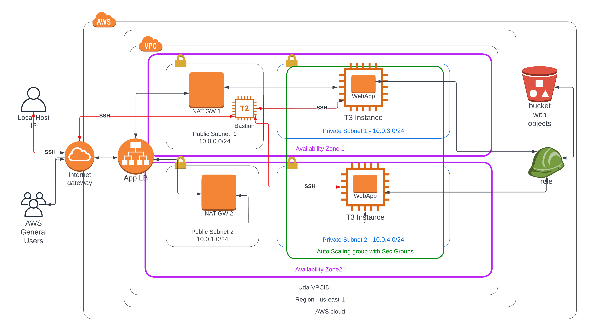
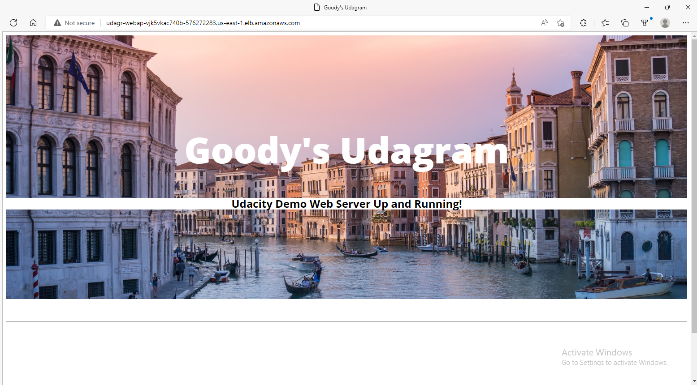

# Udacity Cloud DevOps Nanodegree Program
## Lesson 3- Deploy Infrastructure as Code (IAC)
## Table of Contents
* [Project 2 : Deploy a high-availability web app using CloudFormation](#project-2--deploy-a-high-availability-web-app-using-cloudformation)
* [Description](#description)
* [Infrastructure Diagram](#architecture)
* [Running The Project](#running-the-project)
* [Output](#output)
* [Web App DNS](#webapp-dns)
* [Screenshot](#screenshot)
* [Files Included](#files-included)
* [GitHub Link](#github-link)


## Project 2 : Deploy a high-availability web app using CloudFormation

In this project, you’ll deploy web servers for a highly available web app using CloudFormation. 
You will write the code that creates and deploys the infrastructure and application for an 
Instagram-like app from the ground up. You will begin with deploying the networking components, 
followed by servers, security roles and software.  

Create a Launch Configuration in order to deploy four servers, two located in each of your private subnets.  
The launch configuration will be used by an auto-scaling group.  
You'll need two vCPUs and at least 4GB of RAM. The Operating System to be used is Ubuntu 18.  
So, choose an Instance size and Machine Image (AMI) that best fits this spec.  
Be sure to allocate at least 10GB of disk space so that you don't run into issues.

### Description

This projects aims at combining the powers of Infrastructure Diagramming and deploying cloud infrastructure 
using code. CloudFormation is the AWS service that makes it possible to deploy infrastructure as code (IAC).
Firstly, we created a network stack to set up the network aspects of the project with VPC, Availability Zones,
Public and Private Subnets as well as Route tables to define connection rules.

Secondly, we create the service stack comprising of Launch configuration to deploy the servers for our WebApp.
Cloudwatch Alarms were set up to monitor our servers and keep us informed on scaling activities.
Included in the server stack is abastion host set up in a public subnet to enable the engineer to SSH into the 
servers in the private subnet for troubleshooting purposes (using only his/her device IP).

Finally, our WebApp files are accessed from our S3 bucket into our Apache server.

### Infrastructure Diagram


### Running the project:

1. First, create the stack for network infrastructure using:
```shell
./network.sh
```
The script lets you know what profile you are working on, so that you can run the script with the right profile.
Then it checks to see if the stack you are trying to create exists. If it doesn't exist, it asks for your approval 
to create the new stack. If the stack exists, it gives you the option to either update or delete the stack.

2. After creating the network stack successfully, manually create an S3 bucket named 'udagram-mini-site' and upload the udagram.zip 
file into the bucket. (You may use AWS CLI or directly on AWS console). Make the S3 bucket public.

3. If the network stack and S3 bucket are created successfully, then create the server stack using: 

```shell
./server.sh
 ```
The script lets you know what profile you are working on, so that you can run the script with the right profile.
Then it checks to see if the stack you are trying to create exists. If it doesn't exist, it asks for your approval 
to create the new stack. If the stack exists, it gives you the option to either update or delete the stack.
 

### Output
The output after successfully creating the service stack is this  [`URL`](http://udagr-WebAp-VJK5VKAC740B-576272283.us-east-1.elb.amazonaws.com).

# WebApp DNS
http://udagr-WebAp-VJK5VKAC740B-576272283.us-east-1.elb.amazonaws.com

## Screenshot



### Files included:

- [`ournetwork.yaml`](./ournetwork.yaml) - CloudFormation network infrastructure stack.
- [`ourparameters.json`](./network-parameters.json) - Parameters file for the network stack.
- [`ourservers.yaml`](./services.yaml) - CloudFormation services infrastructure stack.
- [`network.sh`](./run-networks.sh) - bash script for managing our network infrastructure stack
- [`server.sh`](./run-services.sh) - bash script for managing our services infrastructure stack
- [`Url.txt`](./Url.txt) - a text file showing link to the web app
- [IAC-Udagram.png](./IAC-Udagram.png) - IAC diagram
- [Web App Homepage](./Udagram-WebApp.PNG) - Web App Home Page
## GitHub Link
https://github.com/nittybekky/Udacity-Devops
